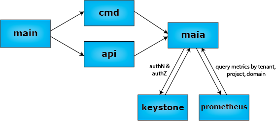

# Maia

Maia is a multi-tenant OpenStack-service for accessing metrics and alarms collected through Prometheus. It offers 
a [Prometheus-compatible](https://prometheus.io/docs/querying/api/) API and supports federation.

At SAP we use it to share tenant-specific metrics from our Converged Cloud platform
with our users. For their convenience we included a CLI, so that metrics can be discovered and
retrieved from shell scripts.

If you don't use OpenStack, you can still use Maia CLI as a feature-complete shell client for Prometheus. 

## Features

[Maia Service](#deploying-the-maia-service)
* OpenStack Identity v3 authentication and authorization
* Project- and domain-level access control (scoping)
* Compatible to Grafana's Prometheus data source 
* Compatible to Prometheus API (read-only)
* Supports federation with other Prometheus

[Maia UI](#using-the-maia-ui)
* Prometheus expression browser adapted to Maia
* List metrics
* Perform ad-hoc queries
 
[Maia CLI](#using-the-maia-client)
* Feature-complete CLI supporting all API operations
* JSON and Go-template-based output for reliable automation
* Works with Prometheus, too (no OpenStack required)

## Concept

Maia adds multi-tenant support to an existing Prometheus installation by using dedicated labels to assign metrics to
OpenStack projects and domains. These labels either have to be supplied by the exporters or they have to be
mapped from other labels using the [Prometheus relabelling](https://prometheus.io/docs/operating/configuration/#relabel_config)
capabilities.
 
The following labels have a special meaning in Maia. *Only metrics with these labels are visible through the Maia API.*
 
 | Label Key  | Description  |
 |------------|--------------|
 | project_id | OpenStack project UUID |
 | domain_id  | OpenStack domain UUID |
 
Metrics without `project_id` will be omitted when project scope is used. Likewise, metrics without `domain_id` will not
be available when authorized to domain scope. There is no inheritance of metrics to parent projects. Users authorized
to a domain will be able to access the metrics of all projects in that domain that have been labelled for the domain.

# Installation

Via Makefile

* `make` to compile and run the binaries from the `build/` directory
* `make && make install` to install to `/usr`
* `make && make install PREFIX=/some/path` to install to `/some/path`
* `make docker` to build the Docker image (set image name and tag with the `DOCKER_IMAGE` and `DOCKER_TAG` variables)

# Deploying the Maia Service

Maia is depending on an existing\* Prometheus installation that is responsible for collecting metrics. These metrics are exposed
by Maia using the same, familiar Prometheus API. The only difference is that all API requests have to be authenticated and scoped using
either OpenStack identity tokens or basic authentication.

\* If you do not have a running installation of Prometheus, you can download Prometheus from the
[Prometheus.io website](https://prometheus.io/download/) and get it up and running quickly with e.g. Docker.

## Configuration

The service is configured using a TOML configuration file that is usually located in `etc/maia/maia.conf`. This file
contains settings for the connection to Prometheus, the integration with OpenStack identity and technical configuration
like the bind-address of the server process. You can always override the entries of this file using command line parameters.

Use the example in the `etc` folder of this repo to get started. 

The *maia* section contains Maia-specific options.

```
[maia]
```

### Connectivity

First you need to decide which port the Maia service should listen to. 
```
bind_address = "0.0.0.0:9091"
```

To reach Prometheus, Maia needs to know the URL where it is running and optionally a proxy to get through.

```
prometheus_url = "http://myprometheus:9090"
# proxy = proxy for reaching <prometheus_url>
```

### Performance

The Prometheus API does not offer an efficient way to list known all historic label values for a given tenant. This
makes the [label-values API](https://prometheus.io/docs/querying/api/#querying-label-values) implementation a
complex operation.

In tenants with a high number of metric series, it is therefore highly recommended to limit the lifetime of label
values, so that older series with no recent data are not considered by the API. Otherwise you risk timeouts
and/or overload of your Prometheus backend. As a side-effect users of templated Grafana dashboards will not be
confronted with stale series in the dropdown boxes.

```
# ignore label values from series older than 2h 
label_value_ttl = "2h"
```

### Keystone Integration
 
The *keystone* section contains configuration settings for OpenStack authentication and authorization.

```
[keystone]
```

#### OpenStack Service User

The maia service requires an OpenStack *service* user in order to authenticate and authorize clients.
 
```
# Identity service used to authenticate user credentials (create/verify tokens etc.)
auth_url = "https://identity.mydomain.com/v3/"
# service user credentials
username = "maia"
password = "asafepassword"
user_domain_name = "Default"
project_name = "serviceusers"
project_domain_name = "Default"
```

#### Authorization

An OpenStack [policy file](https://docs.openstack.org/security-guide/identity/policies.html) controls the
authorization of incoming requests. The roles mentioned in the policy file also need to be
listed in the configuration, so that Maia can discover which projects are relevant
for monitoring.

```
policy_file = "/etc/maia/policy.json"
roles = "monitoring_viewer,monitoring_admin"
```

Maia distinguishes the following permissions
* `metric:list`: List which metrics and measurement series are available for inspection
* `metric:show`: Show actual measurement data (details)

#### Default Domain

To logging into the UI without specifying a user-domain, you can specify which user-domain should be used
by default. By default this is the `Default` domain of OpenStack.

```
default_user_domain_name = "myOSDomain"
```

#### Token Cache

In order to improve responsiveness and protect Keystone from too much load, Maia will
re-check authorizations for users only every 15 minutes (900 seconds).

If the token TTL configured at Keystone is shorter or if you want to reduce Keystone load further,
this amount can be changed:

```
token_cache_time = "3600s"
```

## Starting the Service

Once you have finalized the configuration file, you are set to go

```
maia serve
```

## Available Exporters

As explained in the Concept chapter, Maia requires all series to be labelled with OpenStack project_id resp. domain_id.

The following exporters are known to produce suitible metrics:
* [VCenter Exporter](https://github.com/sapcc/vcenter-exporter) provides project-specific metrics from an OpenStack-
controlled VCenter. 
* [SNMP Exporter](https://github.com/prometheus/snmp_exporter) can be configured to extract project IDs from
SNMP variables into labels. Since most of the SNMP-enabled devices are shared, only a few metrics can be mapped to
OpenStack projects or domains.


## Notes on Scalability

Currently Maia only supports a single Prometheus backend as data source. Therefore scalability has to happen behind the
Prometheus that is used by Maia.

Availability can be improved by setting up multiple identical Prometheus instances and using a reverse proxy for failover. Maia itself 
is stateless, so multiple instances can be spawned without risking collisions.

# Using the Maia Client

The `maia` command can also be used to retrieve metrics from the Maia service. It behaves like any other OpenStack
 CLI, supporting the same command line options and environment variables for authentication:

| Option | Environment Variable | Description |
|--------|----------------------|-------------|
| --os-username | OS_USERNAME | OpenStack username, requires `os-user-domain-name` |
| --os-user-id | OS_USER_ID | OpenStack user unique ID |
| --os-password | OS_PASSWORD | Password |
| --os-user-domain-name | OS_USER_DOMAIN_NAME | domain name, qualifying the username (default: `Default`) |
| --os-user-domain-id | OS_USER_DOMAIN_ID | domain unique ID, qualifying the username (default: `default`) |
| --os-project-name | OS_PROJECT_NAME | OpenStack project name for authorization scoping to project, requires `os-project-domain-name` |
| --os-project-id | OS_PROJECT_ID | OpenStack project unique ID |
| --os-domain-name | OS_DOMAIN_NAME | OpenStack domain name for authorization scoping to domain |
| --os-domain-id | OS_DOMAIN_ID | OpenStack domain unique ID for authorization scoping to domain |
| --os-token | OS_TOKEN | Pregenerated Keystone token with authorization scope |
| --os-auth-url | OS_AUTH_URL | Endpoint of the Identity v3 service. Needed to authentication and Maia endpoint lookup |

Usually, you can reuse your existing RC-files. For performance reasons, you should consider token-based
authentication whenever you make several calls to the Maia CLI.

Use `openstack token issue` to generate a token and pass it to the Maia CLI in the `OS_TOKEN` variable.
 
```
export OS_TOKEN=$(openstack token issue -c id -f value)
```
 
If for some reason you want to use another Maia endpoint than the one registered in the OpenStack service catalog,
then you can override its URL using the `--maia-url` option:

| Option | Environment Variable | Description |
|--------|----------------------|-------------|
| --maia-url | MAIA_URL | URL of the Maia service endpoint |

In the examples below we assume that you have initialized the OS_* variables your shell environment properly and that
your user has the prerequisite roles (e.g. `monitoring_viewer`) on the project in scope.

Type `maia --help` to get a full list of commands and options options with documentation.

```
maia --help
```

## Show Known Measurement Series
 
Use the `series` command to get a list of all measurement series. You can restrict the timeframe using
the parameters `--start` and `--end`. 

```
maia series --selector "__name__=~'vc.*'" --start '2017-07-26T10:46:25+02:00'
```

The list of series can be filtered using Prometheus label matchers. Don't forget to put it in quotes.
```
maia snapshot --selector 'job="endpoints"' ...
```
 
## List Known Metric Names

Use the `metric-names` command to obtain a list of metric names.

```
maia metric-names
```

## List Known Label Values

Use the `label-values` command to obtain known values for a given label.

```
maia label-values "job"
```

Note that stale series which did not receive measurements recently may not be considered for this list.

## Query Metrics with PromQL

Use the `query` command to perform an arbitrary [PromQL-query](https://prometheus.io/docs/querying/basics/) against Maia.
It returns a single entry for each series.  

```
maia query 'vcenter_virtualDisk_totalWriteLatency_average{vmware_name:"win_cifs_13"}'
```

Historical values can obtained by defining a start- and/or end-time for the query. In Prometheus terms, this is called a
*range query*.

```
maia query 'vcenter ...' --start 2017-07-01T05:10:51.781Z 
```

Check `maia query --help` for more options. Timestamps can be specified in Unix or RFC3339 format. Durations are
specififed as numbers with a unit suffix, such as "30s", "1.5h" or "2h45m". Valid time units are "ns", "us" (or "?s"),
"ms", "s", "m", "h".

## Output Formatting

By default maia prints results as unformatted text.

Series data is formatted in raw tables without column alignment.
Labels are used as columns (alphabetical sorting). There are three additional columns which do not refer
to labels:

| Column Name | Meaning |
|-------------|---------|
| \_\_name\_\_ | the metric name |
| \_\_timestamp\_\_ |  the timestamp of a measurement |
| \_\_value\_\_ | the value of a measurement |

To enable automation, also JSON, plain values output and Go text-templates
are supported. 

The output is controlled via the parameters `--format`, `--columns`, `--separator`and `--template`.

| Format   | Description | Additional Options                                                              |
|----------|-------------|---------------------------------------------------------------------------------|
| table | text output in tabular form | `--columns`: selects which metric-labels are displayed as columns<br>`--separator`: defines how columns are separated        |
| value | output of plain values in lists or tables | like `table`                                          |
| json     | JSON output of Maia/Prometheus server. Contains additional status/error information. See [Prometheus API doc.](https://prometheus.io/docs/querying/api/#expression-query-result-formats) | none |
| template | Highly configurable output, applying [Go-templates](https://golang.org/pkg/text/template/) to the JSON response (see `json`format) | `--template`: Go-template expression |  

## Exporting Snapshots

Use the `snapshot` command to get the latest values of all series in
[textual form](https://prometheus.io/docs/instrumenting/exposition_formats/). 

```
maia snapshot --maia-url http://localhost:9091
```

The amount of data can be restricted using Prometheus label matchers, i.e. constraints on label values:

```
maia snapshot --selector 'job="endpoints"' ...
```

If you want to preprocess/filter data further, you can e.g. use the [prom2json](https://github.com/prometheus/prom2json)
tool together with [jq](https://github.com/stedolan/jq).

## Use Maia Client with Prometheus

You can also use the maia client with a plain Prometheus (no authentication).

```
maia snapshot --prometheus-url http://localhost:9090
```

# Using the Maia UI

Maia comes with the well-known [Expression Browser](https://prometheus.io/docs/visualization/browser/) borrowed from
Prometheus.

You can it to discover metrics and perform ad-hoc queries.

Just log-on using your OpenStack credentials. 

```
URL: https://maia.myopenstack.net/myUserDomain
Username: myUser
Password: ********
```

Maia will choose a project for you. You can switch to any other project via the dropdown menu on the top-right side.

Instead of adding the name of the user-domain (e.g. `myUserDomain`) to the URL, you may also specify it as part of
the username, when the browser prompts for your credentials.

```
Username: myUser@myUserDomain
Password: ******
```

If you neither specifiy the user-domain in the username nor the URL, Maia will assume that the user is part
of the configured default domain (not to be confused with the OpenStack domain `default`).

```
URL: https://maia.myopenstack.net
Username: myUser
```

You may also use the special username syntax described [here](#openstack-authentication-and-authorization)
to log right into your target project. 

```
Username: myUser@mydomain|myproject@mydomain
Password: ********
```

# Federating Tenant Metrics from Maia to another Prometheus

To configure Prometheus to receive data from Maia, the following job configuration has to be applied.
In the `basic_auth` section a valid user id, project id and password, corresponding to your OpenStack User and Project, has to be provided.
Moreover the user is required to have the `metric-list` role.

```yaml
scrape_configs:

  # The job name is added as a label `job=<job_name>` to any timeseries scraped from this config.
  - job_name: 'maia'
    metrics_path: "/federate"
    basic_auth:
      # Corresponds to your OpenStack User and Project
      username: <user_id>|<project_id>
      password: <password>

    static_configs:
      - targets: ['maia.<region>.cloud.sap:443']
  
```

Prometheus' targets page ( Status -> Targets ) should the new job and the endpoint with `State UP`. 
The `Error` column should be empty. 
It might indicate a failed authorization (`401 Unauthorized`).

# Using the Maia API

The Maia implements the readonly part of the [Prometheus API doc.](https://prometheus.io/docs/querying/api) and adds
OpenStack authentication and authorization on top.

## OpenStack Authentication and Authorization

In addition to 'native' OpenStack authentication using Keystone tokens, Maia supports basic authentication in order 
to support existing clients like Grafana and federated Prometheus. 

The problem with basic authentication is that it lacks a standard way to express OpenStack domain information. Also there
 is no means to express OpenStack authorization scopes. Since neither Prometheus nor Grafana support adding custom
 header fields to the requests to Prometheus and thus Maia, we have to encode both the domain information and 
 into the username.
 
 For the domain qualification, we could borrow "@" from e-mail. So when a user or a project is identified by name, you
  can add the domain in the form `username@domainname`. 
  
 The authorization scope is separated from the qualified username with a vertical bar "|", splitting the username
 into a username and scope part: `user|scope`. Like with usernames, also the scoped project resp. domain can be
 denoted by name: `projectname@domainname`. To disambiguate scoping by project-id and domain-name, the domain is always prefixed
 with `@`.
 
## Variants
 
This scheme expands into five variants to express username and authorization scope:
 
Project scoped user:
* `user_id|project_id`
* `username@user_domain_name|project_id`
* `user_id|project_name@project_domain_name`
* `username@user_domain_name|project_name@project_domain_name`
* `username@user_domain_name|project_name` (if project_domain_name = user_domain_name)

Domain scoped user:
* `user_id|@domain_name`
* `user_name@user_domain_name|@domain_name`
 
# Using the Prometheus Data Source in Grafana with Maia
 
Configure the data source like with a regular Prometheus. Select `Basic Authentication` and enter the extended
 user credentials following the scheme explained in the [Maia API section](#openstack-authentication-and-authorization).

# Contributing

This project is open for external contributions. The issue list shows what is planned for upcoming releases.

Pull-requests are welcome as long as you follow a few rules:
* Keep the API compatible to Prometheus
* Do not degrade performance
* Include unit tests for new or modified code
* Pass the static code checks
* Keep the architecture intact, don't add shortcuts, layers, ...

## Software Design

Goals of the Maia service:
* Add a multi-tenant security model to Prometheus non-intrusively
  - with OpenStack being the first _driver_ in an otherwise pluggable architecture
* Maintain API compatibility to Prometheus to reuse clients

Components/Packages
* api: Implementation of the API
* cmd: Implementation of the CLI
* keystone: authentication plugin(s)
* prometheus: glue code to attach to a Prometheus as storage

The latter packages will probably be renamed if we decide to support additional user
management services or other monitoring backends (e.g. project cortex).



## Links

[](https://travis-ci.org/sapcc/maia)
[](https://coveralls.io/github/sapcc/maia?branch=master)
[](https://goreportcard.com/report/github.com/sapcc/maia)
[](https://godoc.org/github.com/sapcc/maia)

